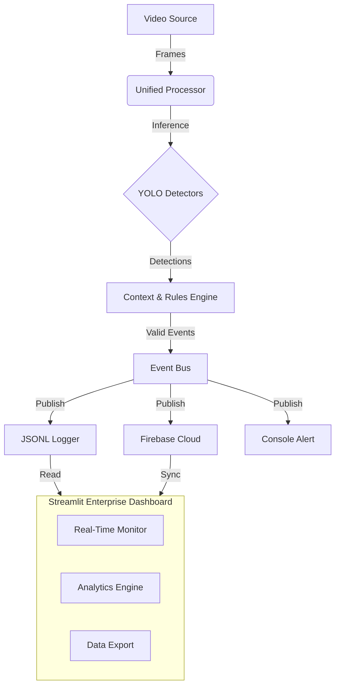

<div align="center">

# 🛣️ CAMVIEW.AI
### Enterprise-Grade Intelligent Traffic Safety Intelligence System

[](https://www.python.org/)
[](https://streamlit.io/)
[](https://docs.ultralytics.com/)
[](https://opencv.org/)
[](https://opensource.org/licenses/MIT)


**Beyond Simple Detection: Real-Time Event Reasoning for Safer Roads**

[Features](#-core-features) • [Architecture](#-system-architecture) • [Installation](#-installation) • [Usage](#-usage) • [Dashboard](#-real-time-dashboard)

</div>

---

## 🔍 The Problem

Modern traffic monitoring systems face significant challenges:
- ❌ **High False Positives**: Traditional single-frame detection triggers incorrectly on shadows or static objects.
- ❌ **Delayed Response**: Manual surveillance cannot react instantly to critical hazards.
- ❌ **Fragmented Data**: Disconnected systems for violations, emergencies, and maintenance (potholes) create data silos.
- ❌ **Lack of Context**: Simple object detection fails to understand *behavior* over time (e.g., wrong-way driving).

## 💡 The CAMVIEW.AI Solution

**CAMVIEW.AI** moves beyond basic object detection. It is an **Event-Driven Computer Vision System** that transforms raw video feeds into structured, actionable safety intelligence.

By combining deep learning with temporal logic and an event bus architecture, it reasons about motion, context, and persistence to deliver **enterprise-grade reliability**.

---

## ✨ Core Features

### 🚘 **Wrong-Side Driving Detection**
- **Temporal Tracking**: Tracks vehicle motion vectors across multiple frames, not just single images.
- **Lane-Aware Logic**: Uses directional smoothing to confirm violations only after consistent behavior.
- **False-Positive Suppression**: Eliminates duplicate alerts for the same vehicle.

### 🚑 **Emergency Vehicle Priority**
- **Visual Recognition**: Detects ambulances, fire trucks, and police vehicles using vision cues.
- **Preemption Ready**: Generates high-priority events designed for integration with smart traffic signals.
- **Priority Logging**: Flags events for immediate attention in the dashboard.

### 🕳️ **Pothole Detection & Analytics**
- **Hazard Identification**: Detects road surface irregularities in real-time.
- **Severity Estimation**: Automatically assigns severity (Low/Medium/High) based on hazard size/area.
- **Maintenance Data**: Provides structured logs for infrastructure planning.

### 🧠 **Event-Driven Architecture (Key Differentiator)**
- **Decoupled Design**: Separates Detection, Rules, and Actions.
- **Internal Event Bus**: Events flow asynchronously through the system.
- **Extensible**: Add new detectors (e.g., helmet detection) without rewriting the logging or UI code.

---

## 🏗️ System Architecture




---

## 🛠️ Technology Stack

| Component | Technology | Purpose |
|-----------|------------|---------|
| **Core Logic** | Python 3.10+ | Engine & Event Bus implementation |
| **Vision** | OpenCV | Video capture using hardware acceleration |
| **AI Model** | Ultralytics YOLO | Object Detection, Classification & Tracking |
| **UI/UX** | Streamlit | Real-time Enterprise Dashboard |
| **Cloud** | Firebase | Cloud syncing & Remote Monitoring (Optional) |
| **Logging** | JSONL | High-performance, append-only structured logs |
| **Data** | Pandas & Plotly | Advanced Analytics & Interactive Visualizations |

---

## 📦 Installation

1.  **Clone the Repository**
    ```bash
    git clone https://github.com/your-username/CAMVIEW.AI.git
    cd CAMVIEW.AI
    ```

2.  **Create Virtual Environment (Recommended)**
    ```bash
    # Windows
    python -m venv venv
    .\venv\Scripts\activate

    # Linux / macOS
    python3 -m venv venv
    source venv/bin/activate
    ```

3.  **Install Dependencies**
    ```bash
    pip install -r requirements.txt
    ```
    > *Note: First run will automatically download necessary YOLO models.*

---

## ▶️ Usage

### 1. Run the AI Engine
Start the backend detection engine. This processes video and generates events.
```bash
# Use Webcam
python main.py --source 0

# Use Video File
python main.py --source data/raw/traffic_video.mp4
```

### 2. Launch the Dashboard
Open a new terminal to run the visualization interface.
```bash
streamlit run app.py
```
> Access the dashboard at **http://localhost:8501**

---

## 📊 Real-Time Dashboard

The system includes a **Streamlit-based Enterprise Dashboard**:
*   **Live Preview**: Low-latency video feed with bounding box overlays.
*   **Event Feed**: Real-time scrolling log of violations and hazards.
*   **Analytics Tab**: Interactive charts for Event Type Distribution, Severity Timeline, and Hourly Heatmaps.
*   **Data Export**: Download logs in CSV, JSON, or Excel formats.

---

## ⚠️ Limitations & Integrity

We believe in honest engineering. Current system constraints:
*   **Streamlit FPS**: Optimized for stability over raw speed (approx 5-10 FPS preview).
*   **Geo-Tagging**: Pothole locations are currently relative to the frame, not GPS coordinates.
*   **Lighting**: Performance may decrease in extreme low-light conditions without IR cameras.

---

## 🚀 Future Roadmap

- [ ] **GPS Integration**: Google Maps API for real-world pothole plotting.
- [ ] **RTSP Support**: Native integration for IP Security Cameras.
- [ ] **WebRTC**: Lower latency video streaming for the dashboard.
- [ ] **Edge Deployment**: Optimization for Jetson Nano / Raspberry Pi 5.

---

<div align="center">

**© 2026 CAMVIEW.AI** • *Engineering Safety Intelligence*

</div>


3.  **Install Dependencies**:
    ```bash
    pip install -r requirements.txt
    ```
    (Note: `ultralytics` will automatically download the YOLOv8 model on first run).

## Usage

### 1. Run the AI Engine (Terminal)
This runs the main detection loop and prints alerts to the console.
```bash
# Run with webcam
python main.py --source 0

# Run with a video file
python main.py --source data/raw/traffic_video.mp4
```

### 2. Run the Dashboard
Open a separate terminal to view the live dashboard.
```bash
streamlit run app.py
```

## Folder Structure
- `core/`: Core engine, Event Bus, and Event definitions.
- `detectors/`: Specific logic for each problem statement (Wrong-side, etc.).
- `config/`: Settings and constants.
- `data/logs/`: Stores `events.jsonl` for the dashboard.
